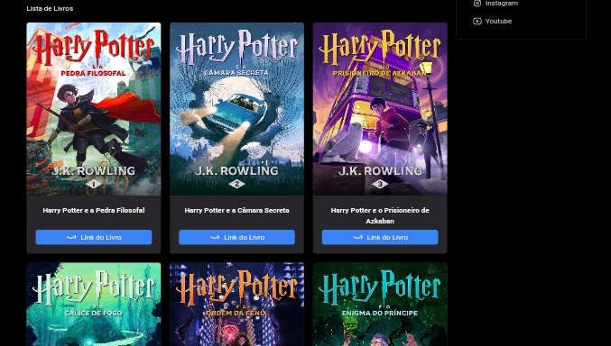

<h2 align="center">Ordem de Livros</h2>

<p align="center">
Projeto desenvolvido com foco em aprimorar habilidades de front-end utilizando SvelteKit e outras tecnologias modernas 🚀⚡. <br/>
</p>

- [Visão geral](#visão-geral)
  - [Sobre o projeto](#sobre-o-projeto)
  - [Screenshots](#screenshots)
  - [Links](#links)
- [Meu processo](#meu-processo)
  - [Tecnologias](#tecnologias)
  - [Continuar o desenvolvimento](#continuar-o-desenvolvimento)
  - [Recursos úteis](#recursos-úteis)
- [Como rodar localmente](#como-rodar-localmente)
- [Autor](#autor)

</br>

## Visão geral

### Sobre o projeto
O **Ordem de Livros** é um site onde os usuários podem visualizar a ordem de livros de interesse, aprender mais sobre os autores dessas obras e explorar sua história de vida. Atualmente, o projeto conta com três autores e três sagas literárias: **Harry Potter**, **O Senhor dos Anéis** e **As Crônicas de Gelo e Fogo**. 

Funcionalidades principais:
- **Página inicial (Home):** Exibe os títulos disponíveis. Ao clicar em um título, o usuário é direcionado para uma página com detalhes sobre a saga e a ordem dos livros.
- **Redirecionamento externo:** Ao clicar em um livro específico, o usuário é direcionado para o site da Amazon para mais informações.
- **Página de autores:** Permite navegar por informações gerais sobre os autores e acessar páginas dedicadas a cada autor.
- **Navegação lateral:** O site possui uma barra lateral para facilitar a navegação entre as páginas.

Atualmente, o projeto ainda não é responsivo para dispositivos móveis, mas isso será adicionado em breve.

### Screenshots
<p align="center">
  
</p>
<p align="center">
  
</p>

### Links
- [Acesse o projeto finalizado, online ☁️](https://ordem-livros-to.vercel.app/)

</br>

## Meu processo

### Tecnologias
Este projeto foi desenvolvido utilizando as seguintes tecnologias e ferramentas:

- **SvelteKit**: Framework moderno para desenvolvimento web.
- **Vite.js**: Ferramenta utilizada para inicializar o projeto com rapidez.
- **Tailwind CSS**: Framework para estilização rápida e consistente.
- **JavaScript**: Para lógica de programação e interatividade.
- **Git e GitHub**: Versionamento de código e hospedagem do repositório.

### Continuar o desenvolvimento
- Adicionar **responsividade** para dispositivos móveis.
- Expandir a quantidade de autores e livros disponíveis.
- Implementar um sistema de busca e filtro por títulos e autores.

### Recursos úteis
- [Documentação do SvelteKit](https://kit.svelte.dev/docs) - Guia oficial para entender o funcionamento do SvelteKit.
- [Introdução ao Tailwind CSS](https://tailwindcss.com/docs/installation) - Aprenda a configurar e utilizar o Tailwind CSS.

</br>

## Como rodar localmente

Para executar o projeto localmente, siga estas etapas:

1. **Clone o repositório:**
   ```bash
   git clone https://github.com/JoaoAlisonTI/ordem-livros.git
   cd ordem-livros
   ```

2. **Instale as dependências:**
   Certifique-se de ter o Node.js instalado. Em seguida, execute:
   ```bash
   npm install
   ```

3. **Inicie o servidor de desenvolvimento:**
   ```bash
   npm run dev
   ```

4. **Acesse o projeto no navegador:**
   O projeto estará disponível em `http://localhost:5173`.

5. **Customização:**
   Para fazer alterações, edite os arquivos no diretório `src` e salve para ver as mudanças refletidas em tempo real.

</br>

## Autor
*JoaoAlisonTI* 👨🏽‍💻  

---

**2024**